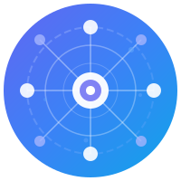

# OFA - Omni Federated Agents

<p align="center">
  
</p>

<p align="center">
  <strong>多设备分布式智能体系统 | Multi-Device Distributed Agent System</strong>
</p>

<p align="center">
  <em>Omni - 全能 | Federated - 分布式 | Agents - 智能体</em>
</p>

---

<p align="center">
  <strong>愿景 | Vision</strong>
</p>

<p align="center">
  <em>万物皆为我所用，万物皆是我。</em>
</p>

<p align="center">
  <em>All things serve me, yet all things are me.</em>
</p>

<p align="center">
  <small>—— 让每一台设备都承载同一个灵魂，让每一个终端都懂得如何为你服务</small>
</p>

---

<p align="center">
  <a href="#简介">中文</a> | <a href="#introduction">English</a>
</p>

<p align="center">
  <a href="https://github.com/taomic2035/OFA/releases"></a>
  <a href="https://goreportcard.com/report/github.com/taomic2035/OFA"></a>
  <a href="https://github.com/taomic2035/OFA/blob/main/LICENSE"></a>
  <a href="https://github.com/taomic2035/OFA/stargazers"></a>
</p>

---

## 简介

OFA (Omni Federated Agents) 是一个跨设备的多Agent分布式系统，支持手机、平板、电脑、手表、IoT设备等智能设备的协同工作。系统由 Center（算力中心）和多个 Agent（设备节点）组成，通过 gRPC 和 MQTT 实现高效通信。

### 核心特性

#### 🚀 v2.0 去中心化分布式架构

| 版本 | 特性 | 描述 |
|------|------|------|
| **v3.1.0** | 设备状态同步 | 设备在线/电池/网络/场景状态实时同步与广播 |
| **v3.0.0** | 设备消息总线 | Center-设备消息通道、离线消息、优先级管理 |
| **v2.9.0** | 性格进化引擎 | 稳定性检测、MBTI收敛、时间衰减、趋势分析 |
| **v2.8.0** | 设备生命周期与信任链 | 设备优先级管理、信任级别、设备更换支持 |
| **v2.7.0** | 数据持久化增强 | PostgreSQL 身份存储 + Redis 设备缓存，确保灵魂永存 |
| **v2.6.0** | Center 权威与冲突仲裁 | Center 是永远在线的灵魂载体，统一决策和纠偏 |
| **v2.5.0** | 身份同步完善 | JSON 完整解析、行为上报 HTTP、Center 性格推断引擎 |
| **v2.4.0** | 行为上报与性格推断 | BehaviorCollector 自动收集行为，实时推断性格特质 |
| **v2.3.0** | 运行模式简化 | CONNECTED/HYBRID 废弃，默认 SYNC 模式 |
| **v2.2.0** | Memory 跨设备同步 | 记忆系统跨设备一致，冲突自动解决 |
| **v2.1.0** | Center 角色转变 | Center 从控制中心转为数据中心，Agent 主动同步 |
| **v2.0.0** | 身份同步基础层 | 所有设备共享同一人格，IdentityManager 统一管理 |

**核心愿景**: "万物皆为我所用，但万物都是我"

**架构理念：**

| 角色 | 职责 | 特性 |
|------|------|------|
| **Center** | 永远在线的灵魂载体 | 最终基准、冲突仲裁、数据纠偏 |
| **Agent** | 设备端载体 | 可离线、可更换、定期同步 |

- **Center 是灵魂中心** - 永远在线，保持最终基准，负责冲突决策和纠偏
- **设备是载体** - 手机、平板、电脑、手表等设备可能离线、更换，但灵魂（Center）一直在
- **冲突仲裁** - 当设备间数据冲突时，由 Center 统一决策
- **人格一致** - 所有设备共享同一人格，通过 Center 保持同步

#### 🆕 v1.4 新特性

| 版本 | 特性 | 描述 |
|------|------|------|
| **v1.4.0** | PostgreSQL 持久化 | 企业级数据持久化，支持 PostgreSQL + Redis 混合存储 |
| **v1.4.0** | Redis 缓存层 | 高性能缓存，在线状态、会话、Pub/Sub |
| **v1.4.0** | 用户画像系统 | MBTI性格、价值观、兴趣爱好、记忆库、偏好系统 |
| **v1.3.0** | WebView 自动化 | JavaScript 执行、表单填充、事件监听、页面适配 |
| **v1.2.1** | 视觉智能增强 | ML Kit OCR、模板匹配、截图对比、元素追踪 |
| **v1.2.0** | 扩展 App 适配器 | 抖音、小红书、滴滴出行自动化支持 |

#### 🤖 AutomationEngine 完整能力

OFA Android SDK 提供完整的 UI 自动化引擎，7 个阶段全部实现：

| 阶段 | 能力 | 组件 |
|------|------|------|
| Phase 1 | 无障碍服务基础 | AccessibilityEngine, NodeFinder, GesturePerformer |
| Phase 2 | UI自动化增强 | ScrollHelper, PageMonitor, ScreenCapture, ActionRecorder |
| Phase 3 | 应用适配层 | 7个App适配器 (美团/饿了么/淘宝/京东/抖音/小红书/滴滴) |
| Phase 4 | ROM系统层 | SystemAutomationEngine, HybridAutomationEngine, KeepAlive |
| Phase 5 | 集成与优化 | AutomationOrchestrator, SkillBridge, ErrorRecovery |
| Phase 6 | 视觉智能 | MlKitOcrEngine, TemplateMatcher, VisionEngine |
| Phase 7 | WebView自动化 | JsExecutor, WebFormFiller, WebEventListener |

**自动化工具定义:**

| 类别 | 工具 | 说明 |
|------|------|------|
| UI操作 | ui.click, ui.longClick, ui.swipe, ui.input | 基础UI操作 |
| UI查询 | ui.find, ui.wait, ui.scrollFind | 元素查找 |
| 视觉 | vision.ocr, vision.match, vision.compare | 视觉识别 |
| 网页 | web.executeJs, web.click, web.fillForm | WebView操作 |
| 系统 | system.installApp, system.grantPermission | 系统级操作 |

#### 📱 MCP协议支持

| 特性 | 描述 |
|------|------|
| **MCP协议集成** | Android SDK 支持 Model Context Protocol，AI Agent 可直接调用设备工具 |
| **50+ 内置工具** | 系统工具、设备工具、数据工具、AI工具、UI自动化工具 |
| **离线执行** | L1-L4 四级离线支持，工具在离线状态仍可执行 |
| **OpenAI兼容** | ToolCallingAdapter 提供 OpenAI Function Calling 格式支持 |
| **双 LLM 支持** | 云端 LLM (OpenAI/Anthropic) + 本地 LLM (TensorFlow Lite) |

#### 📱 多平台支持

支持 10+ 平台的 SDK：

| 平台 | 语言 | 状态 |
|------|------|------|
| Android | Java/Kotlin | ✅ |
| iOS | Swift | ✅ |
| Desktop | Go | ✅ |
| Web | TypeScript | ✅ |
| 可穿戴设备 | Go | ✅ |
| IoT | Go | ✅ |
| Python | Python | ✅ |
| Rust | Rust | ✅ |
| Node.js | TypeScript | ✅ |
| C++ | C++17 | ✅ |

#### 🏢 企业级特性

- **多租户支持**: 租户隔离、资源配额、计费系统
- **高可用集群**: 服务发现、负载均衡、故障转移
- **安全认证**: JWT、mTLS、端到端加密、RBAC权限
- **可观测性**: Prometheus指标、分布式追踪、日志聚合

### 项目规模

| 组件 | 文件数 | 说明 |
|------|--------|------|
| Android SDK | 140+ Java | 完整的移动端智能体 SDK |
| Center | 60+ Go | 分布式智能体中心服务 |
| Dashboard | 15+ Vue | Web 管理控制台 |
| Unit Tests | 40+ | 单元测试覆盖核心组件 |

### 快速开始

```bash
# 克隆仓库
git clone https://github.com/taomic2035/OFA.git
cd OFA

# 构建 Center 服务
cd src/center
go build -o ../../build/center ./cmd/center

# 构建 Agent 客户端
cd ../agent/go
go build -o ../../../build/agent ./cmd/agent

# 启动服务
./build/center
./build/agent --center localhost:9090
```

### Android SDK 集成

```gradle
// build.gradle
dependencies {
    implementation 'com.ofa:agent-sdk:1.3.0'
}
```

```java
// 初始化 OFA Agent
OFAAndroidAgent agent = OFAAndroidAgent.getInstance(context);
agent.initialize("center.example.com:9090");

// 使用自动化引擎
AutomationOrchestrator automation = agent.getAutomationOrchestrator();

// 执行操作
automation.execute("search", Map.of("query", "奶茶"));
automation.executeSkill(foodDeliverySkill, params);

// 使用视觉能力
VisionAutomationEngine vision = automation.getVisionEngine();
String text = vision.recognizeText().fullText;
vision.clickText("确定");

// WebView 自动化
WebViewAutomation web = new WebViewAutomation(webView);
web.loadUrl("https://example.com");
web.click("#submit-btn");
```

### 文档

- [项目指南](docs/PROJECT_GUIDE.md) - 完整的项目指南
- [用户指南](docs/USER_GUIDE.md) - 详细使用说明
- [设备接入指南](docs/DEVICE_GUIDE.md) - Android/iOS/IoT/可穿戴设备接入
- [架构设计](docs/03-ARCHITECTURE_DESIGN.md) - 系统架构说明
- [API文档](docs/API.md) - REST/gRPC API参考
- [部署指南](docs/DEPLOYMENT.md) - Docker/Kubernetes部署
- [开发指南](docs/DEVELOPMENT.md) - 开发环境配置
- [更新日志](CHANGELOG.md) - 版本更新记录

### Web Dashboard

OFA 提供 Web 管理控制台，支持可视化的 Agent/Task 管理:

```bash
# 启动 Dashboard
cd src/dashboard
npm install
npm run dev
# 访问 http://localhost:3000
```

功能模块:
- 📊 **控制台** - 系统概览、统计卡片、实时活动流
- 🤖 **智能体管理** - Agent 列表、搜索、详情、删除
- 📋 **任务管理** - 任务列表、新建表单、状态筛选
- 📈 **系统监控** - 实时指标、WebSocket 更新
- 💬 **消息中心** - 消息发送、广播、历史记录
- 👤 **用户画像** - 个人身份、性格特质、价值观、兴趣爱好、记忆库、偏好设置
- ⚙️ **系统设置** - 连接配置、显示设置

### 许可证

[MIT License](LICENSE)

---

## Introduction

OFA (Omni Federated Agents) is a cross-device distributed agent system that supports smartphones, tablets, computers, wearables, and IoT devices. The system consists of a Center (compute hub) and multiple Agents (device nodes), communicating via gRPC and MQTT.

### Key Features

#### 🚀 v2.0 Decentralized Distributed Architecture

| Version | Feature | Description |
|---------|---------|-------------|
| **v3.1.0** | Device State Sync | Device online/battery/network/scene state real-time sync and broadcast |
| **v3.0.0** | Device Message Bus | Center-device messaging, offline messages, priority management |
| **v2.9.0** | Personality Evolution Engine | Stability detection, MBTI convergence, time decay, trend analysis |
| **v2.8.0** | Device Lifecycle & Trust Chain | Device priority management, trust levels, device replacement support |
| **v2.7.0** | Data Persistence Enhancement | PostgreSQL identity storage + Redis device cache, ensuring soul persistence |
| **v2.6.0** | Center Authority & Conflict Arbitration | Center is the always-online soul carrier, unified decision and reconciliation |
| **v2.5.0** | Identity Sync Enhancement | Full JSON parsing, behavior HTTP reporting, Center personality inference engine |
| **v2.4.0** | Behavior Reporting & Personality Inference | BehaviorCollector auto-collects behaviors, real-time personality inference |
| **v2.3.0** | Run Mode Simplification | CONNECTED/HYBRID deprecated, default SYNC mode |
| **v2.2.0** | Memory Cross-Device Sync | Memory system consistency across devices, auto conflict resolution |
| **v2.1.0** | Center Role Transformation | Center from control hub to data center, Agent proactive sync |
| **v2.0.0** | Identity Sync Foundation | All devices share the same personality, IdentityManager unified management |

**Core Vision**: "All things serve me, but all things are me"

**Architecture Philosophy:**

| Role | Responsibility | Characteristics |
|------|----------------|-----------------|
| **Center** | Always-online soul carrier | Final baseline, conflict arbitration, data reconciliation |
| **Agent** | Device carrier | Can go offline, can be replaced, periodic sync |

- **Center is the soul center** - Always online, maintains final baseline, responsible for conflict decisions and reconciliation
- **Devices are carriers** - Phone, tablet, computer, watch, etc. may go offline or be replaced, but the soul (Center) remains
- **Conflict Arbitration** - When device data conflicts, Center makes unified decisions
- **Personality Consistency** - All devices share the same personality, kept in sync through Center

#### 🆕 v1.4 New Features

| Version | Feature | Description |
|---------|---------|-------------|
| **v1.4.0** | PostgreSQL Persistence | Enterprise-grade data persistence with PostgreSQL + Redis |
| **v1.4.0** | Redis Cache Layer | High-performance caching for online status, sessions, Pub/Sub |
| **v1.4.0** | User Profile System | MBTI personality, values, interests, memory, preferences |
| **v1.3.0** | WebView Automation | JavaScript execution, form filling, event monitoring |
| **v1.2.1** | Vision Intelligence | ML Kit OCR, template matching, screen diff, element tracking |
| **v1.2.0** | Extended App Adapters | Douyin, Xiaohongshu, Didi automation support |

#### 🤖 Complete AutomationEngine

7 phases fully implemented:

| Phase | Capability | Components |
|-------|------------|------------|
| Phase 1 | Accessibility Foundation | AccessibilityEngine, NodeFinder, GesturePerformer |
| Phase 2 | UI Automation Enhanced | ScrollHelper, PageMonitor, ScreenCapture, ActionRecorder |
| Phase 3 | App Adapters | 7 adapters (Meituan/Eleme/Taobao/JD/Douyin/Xiaohongshu/Didi) |
| Phase 4 | ROM System Layer | SystemAutomationEngine, HybridAutomationEngine, KeepAlive |
| Phase 5 | Integration | AutomationOrchestrator, SkillBridge, ErrorRecovery |
| Phase 6 | Vision Intelligence | MlKitOcrEngine, TemplateMatcher, VisionEngine |
| Phase 7 | WebView Automation | JsExecutor, WebFormFiller, WebEventListener |

#### 📱 MCP Protocol Support

| Feature | Description |
|---------|-------------|
| **MCP Integration** | Android SDK supports Model Context Protocol |
| **50+ Built-in Tools** | System, device, data, AI, and UI automation tools |
| **Offline Execution** | L1-L4 offline levels, tools work offline |
| **OpenAI Compatible** | ToolCallingAdapter provides Function Calling format support |
| **Dual LLM Support** | Cloud LLM (OpenAI/Anthropic) + Local LLM (TensorFlow Lite) |

#### 📱 Multi-Platform Support

SDKs for 10+ platforms: Android, iOS, Desktop, Web, Wearables, IoT, Python, Rust, Node.js, C++

#### 🏢 Enterprise Features

- **Multi-tenancy**: Tenant isolation, resource quotas, billing
- **High Availability**: Service discovery, load balancing, failover
- **Security**: JWT, mTLS, E2E encryption, RBAC
- **Observability**: Prometheus metrics, distributed tracing, log aggregation

### Project Scale

| Component | Files | Description |
|-----------|-------|-------------|
| Android SDK | 140+ Java | Complete mobile agent SDK |
| Center | 60+ Go | Distributed agent center service |
| Dashboard | 15+ Vue | Web management console |
| Unit Tests | 40+ | Core component test coverage |

### Quick Start

```bash
# Clone repository
git clone https://github.com/taomic2035/OFA.git
cd OFA

# Build Center service
cd src/center
go build -o ../../build/center ./cmd/center

# Build Agent client
cd ../agent/go
go build -o ../../../build/agent ./cmd/agent

# Run services
./build/center
./build/agent --center localhost:9090
```

### Android SDK Integration

```gradle
// build.gradle
dependencies {
    implementation 'com.ofa:agent-sdk:1.3.0'
}
```

```java
// Initialize OFA Agent
OFAAndroidAgent agent = OFAAndroidAgent.getInstance(context);
agent.initialize("center.example.com:9090");

// Use automation engine
AutomationOrchestrator automation = agent.getAutomationOrchestrator();

// Execute operations
automation.execute("search", Map.of("query", "bubble tea"));
automation.executeSkill(foodDeliverySkill, params);

// Vision capabilities
VisionAutomationEngine vision = automation.getVisionEngine();
String text = vision.recognizeText().fullText;
vision.clickText("Confirm");

// WebView automation
WebViewAutomation web = new WebViewAutomation(webView);
web.loadUrl("https://example.com");
web.click("#submit-btn");
```

### Documentation

- [User Guide](docs/USER_GUIDE.md) - Detailed usage instructions
- [Device Integration Guide](docs/DEVICE_GUIDE.md) - Android/iOS/IoT/Wearable integration
- [Dashboard](src/dashboard/README.md) - Web management console
- [Architecture Design](docs/03-ARCHITECTURE_DESIGN.md) - System architecture
- [API Reference](docs/API.md) - REST/gRPC API reference
- [Deployment Guide](docs/DEPLOYMENT.md) - Docker/Kubernetes deployment
- [Changelog](CHANGELOG.md) - Version history

### License

[MIT License](LICENSE)

---

## Star History

如果这个项目对您有帮助，请给我们一个 ⭐️！

If this project helps you, please give us a ⭐️!